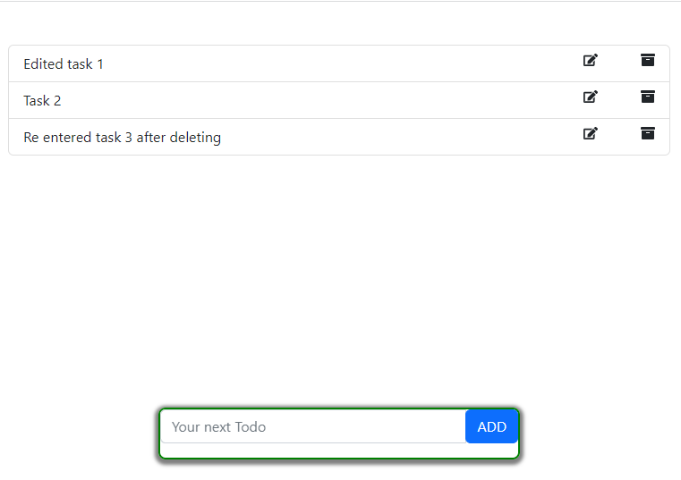

# Todo App

This is a simple Todo app created using React and Redux. It allows users to add, delete, and edit tasks, and stores all the data in the browser's local storage. The app is styled using Bootstrap and Reactstrap for a clean and consistent user interface.

## Features

- Add tasks
- Delete tasks
- Edit tasks
- Store data in local storage

## Usage

1. Type your task in the input field and press enter to add a new task.
2. Click the delete button to delete a task.
3. Click the edit button to edit a task.

## Screenshot

